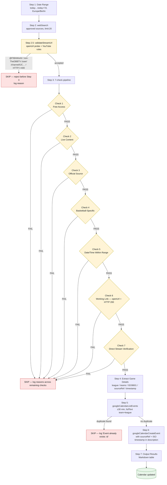

# skill-basketball-streams

AI agent skill: search, validate, and add **FREE basketball live streams in Germany** from official sources to Google Calendar.

> Frontmatter-driven trigger — load this skill whenever the user asks for free / official / German basketball streams, requests validation of a candidate stream URL, or asks to add / verify basketball calendar entries.


## Description

Search for FREE basketball live streams in Germany from approved official sources, validate them with a 7-check pipeline (URL, page content, source allow-list, basketball-specific, date range, live proof, source reference), and add confirmed streams to a Google Calendar. **Not** for paid broadcasters (Sky / DAZN / Prime), highlight reels, or non-basketball sports.

## Trigger phrases

- "find basketball streams"
- "free BBL stream"
- "any free EuroLeague game today?"
- "validate this basketball URL"
- "add stream to basketball calendar"
- "update basketball calendar with free streams"
- "this basketball URL is broken" / "the previous run shipped a 404 link"

## Dataflow — From Search Hit to Calendar Event



ASCII fallback (for renderers that strip Mermaid):

```
[ Step 1: Date Range ] -> [ Step 2: webSearch approved sources ]
                          -> [ Step 2.5: validateStreamUrl ]
                              -> reject: @FIBAWorld | /user/[!=TheDBBTV] | /channel/UC… | HTTP>=400
                              -> pass  -> [ Step 3: 7-check pipeline (all must PASS) ]
                                              -> any FAIL -> SKIP, log reason
                                              -> all PASS -> [ Step 4: extract details ]
                                                              -> [ Step 5: duplicate check ]
                                                                  -> duplicate -> SKIP
                                                                  -> no dup   -> [ Step 6: create event ]
                                                                                  -> [ Step 7: results table ]
```

## File Layout

```
SKILL.md                              Main skill instructions (frontmatter, process, mandates)
README.md                             This file (overview, dataflow, dev workflow)
CHANGELOG.md                          Release history (Keep-a-Changelog format)
evals/
  └── evals.json                      12 standard-schema eval cases (driving the rubric)
scripts/
  ├── validate.py                     Self-contained validator (stdlib only): three checks plus smoke-test regression guard.
  ├── runtime_eval.py                 Scaffold runtime skill-evaluator (structural + runtime passes; canned stub inputs).
  └── README.md                       Maintenance doc: tool list, exit codes, how to add a check/case, CI integration.
tests/
  ├── pytest.ini                      Pytest config (testpaths, default options, warning filter).
  ├── test_validate.py                ~17 subprocess tests for scripts/validate.py.
  └── test_runtime_eval.py            ~10 subprocess tests for scripts/runtime_eval.py.
references/
  ├── approved-sources.md             Approved streaming sources + YouTube URL allow/reject table
  ├── validation-workflow.md          7-check pipeline + special cases + decision logic
  ├── calendar-setup.md               Google Calendar event schema, color codes, duplicate detection
  ├── implementation-notes.md         Search queries, time/team/vocab helpers, validateStreamUrl code, end-to-end workflow sketch
  └── lessons-learned.md              Incident post-mortem, prevention checklist, validation log template + 3 worked examples
```

## Key Features

- 7 mandatory validation checks; **any failure → REJECT, no calendar event.**
- Strict YouTube URL handling: only `@handle`, `@handle/live`, and `user/TheDBBTV` accepted.
- Mandatory direct-stream verification (page content read with `openUrl`).
- Mandatory source reference URL and ISO validation timestamp on every event.
- Duplicate detection via `googleCalendarListEvents` (±30 min, team + league `fullText`).
- Mandatory `## Rationalizations` / `## Red Flags` sections to defend against agent drift.
- Schema-conformant `evals/evals.json` (12 standard-shape cases passable by any external evaluator).

## Approved Sources (top-level categories)

- Dyn Sport Mix (Joyn, Pluto TV, Zattoo free tier only)
- MagentaSport (one free EuroLeague game per matchday)
- Sportschau / ARD
- Regional: MDR, BR24, RBB24
- Official BBL club websites (ALBA Berlin, FC Bayern München, ratiopharm ulm, …)
- Official YouTube channels (`@fiba`, `user/TheDBBTV` accepted; `@FIBAWorld`, generic `/channel/UC…`, and most `/user/…` URLs rejected)

Full table with domains and YouTube allow/reject patterns → `references/approved-sources.md`.

## Calendar

- **Calendar ID:** `f8a14c4037d9ab411f93f19ee369218f0ed54be7c2d88deaf09d6b76fbe72e7f@group.calendar.google.com`
- **Timezone:** `Europe/Berlin`
- **Visibility:** `public`
- **Color code:** `"6"` Tangerine/Orange (default); `"11"` Tomato for EuroLeague finals; `"2"` Sage for FIBA internationals

Event schema and duplicate-check parameters → `references/calendar-setup.md`.

## Quick Verification

A single self-contained validator a maintainer can run from the project root — no external tooling required. For per-check granularity (or to read the spec), use `python3 scripts/validate.py --check {evals,skill,references} --root .` (see `## Available scripts` in SKILL.md).

### Run the validator

```bash
python3 scripts/validate.py --root .
```

Expected: three OK: lines on stdout (one per check) and exit code 0. Use `python3 scripts/validate.py --check {evals,skill,references} --root .` to limit to a single check. The validator is documented in `## Available scripts` of SKILL.md and adds spec-level frontmatter checks (`name` format/length, `compatibility` <=500 chars) beyond what the legacy inline one-liners covered.

## Self-Validation Checklist

Run before each release; every item is checkable without external tooling.

- [ ] `SKILL.md` body is under 250 lines (excluding frontmatter)
- [ ] Frontmatter contains `name`, `description`, `category`, and `version`
- [ ] `description` line is ≤ 1024 chars
- [ ] Includes `## Rationalizations` and `## Red Flags` sections
- [ ] Contains at least 3 realistic eval cases in `evals/evals.json` (currently 12)
- [ ] JSON-shape validation passes (`id:int`, `prompt`, `expected_output`, `assertions[]`)
- [ ] All backtick-wrapped `.md` paths in `SKILL.md` and `README.md` resolve to real files
- [ ] The validator in **Quick Verification** above passes (exit code 0)
