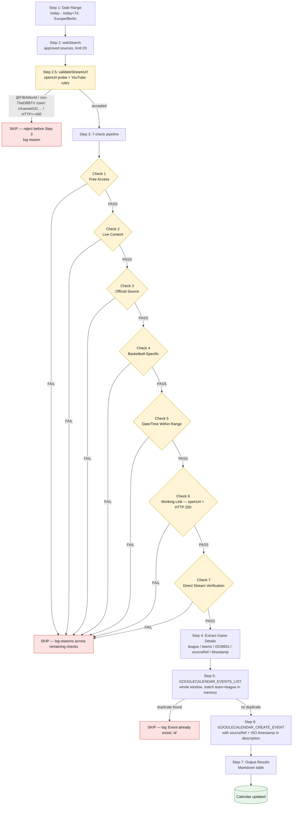

# skill-basketball-streams

AI agent skill: search, validate, and add **FREE basketball live streams in Germany** from official sources to Google Calendar.

> Frontmatter-driven trigger — load this skill whenever the user asks for free / official / German basketball streams, requests validation of a candidate stream URL, or asks to add / verify basketball calendar entries.


## Description

Search for FREE basketball live streams in Germany from approved official sources, validate them with a 7-check pipeline (URL, page content, source allow-list, basketball-specific, date range, live proof, source reference), and add confirmed streams to a Google Calendar. Handles the JS-rendered, bot-blocked `magenta.tv` platform through a fetch ladder, searches YouTube **live-only under a start-datetime-greater-than-now gate**, treats Basketball Champions League free access as **per game, not per source**, and revalidates stored links while quarantining newly discovered sources instead of auto-trusting them. **Not** for paid broadcasters (Sky / DAZN / Prime), highlight reels, or non-basketball sports.

## Trigger phrases

- "find basketball streams"
- "free BBL stream"
- "any free EuroLeague game today?"
- "validate this basketball URL"
- "add stream to basketball calendar"
- "update basketball calendar with free streams"
- "this basketball URL is broken" / "the previous run shipped a 404 link"

## Dataflow — From Search Hit to Calendar Event


```mermaid
flowchart TD
    A[Step 1: Date Range<br/>today…today+7d, Europe/Berlin] --> B[Step 2: webSearch<br/>approved sources, limit:20]
    B --> C[Step 2.5: validateStreamUrl<br/>openUrl probe + YouTube rules]
    C -->|"@FIBAWorld / non-TheDBBTV /user/ /channel/UC… / HTTP>=400"| Z1[SKIP — reject before Step 3<br/>log reason]
    C -->|accepted| D[Step 3: 7-check pipeline]
    D --> E1{Check 1<br/>Free Access}
    E1 -->|FAIL| Z2[SKIP — log reasons across remaining checks]
    E1 -->|PASS| E2{Check 2<br/>Live Content}
    E2 -->|FAIL| Z2
    E2 -->|PASS| E3{Check 3<br/>Official Source}
    E3 -->|FAIL| Z2
    E3 -->|PASS| E4{Check 4<br/>Basketball-Specific}
    E4 -->|FAIL| Z2
    E4 -->|PASS| E5{Check 5<br/>Date/Time Within Range}
    E5 -->|FAIL| Z2
    E5 -->|PASS| E6{Check 6<br/>Working Link — openUrl = HTTP 200}
    E6 -->|FAIL| Z2
    E6 -->|PASS| E7{Check 7<br/>Direct Stream Verification}
    E7 -->|FAIL| Z2
    E7 -->|PASS| F[Step 4: Extract Game Details<br/>league / teams / ISO8601 / sourceRef / timestamp]
    F --> G[Step 5: GOOGLECALENDAR_EVENTS_LIST<br/>whole window, match team+league in memory]
    G -->|duplicate found| Z3[SKIP — log 'Event already exists: id']
    G -->|no duplicate| H[Step 6: GOOGLECALENDAR_CREATE_EVENT<br/>with sourceRef + ISO timestamp in description]
    H --> I[Step 7: Output Results<br/>Markdown table]
    I --> J[(Calendar updated)]

    classDef reject fill:#fde2e2,stroke:#c62828,color:#1a1a1a
    classDef gate fill:#fff4d6,stroke:#b6a300,color:#1a1a1a
    classDef ok fill:#e8f5e9,stroke:#2e7d32,color:#1a1a1a
    class Z1,Z2,Z3 reject
    class E1,E2,E3,E4,E5,E6,E7,C gate
    class J ok
```

ASCII fallback (for renderers that strip Mermaid):

```
[ Step 1: Date Range ] -> [ Step 2: webSearch approved sources ]
                          -> [ Step 2.5: validateStreamUrl ]
                              -> reject: @FIBAWorld | /user/[!=TheDBBTV] | /channel/UC… | HTTP>=400
                              -> pass  -> [ Step 3: 7-check pipeline (all must PASS) ]
                                              -> any FAIL -> SKIP, log reason
                                              -> all PASS -> [ Step 4: extract details ]
                                                              -> [ Step 5: duplicate check ]
                                                                  -> duplicate -> SKIP
                                                                  -> no dup   -> [ Step 6: create event ]
                                                                                  -> [ Step 7: results table ]
```

## File Layout

```
SKILL.md                              Main skill instructions (frontmatter, process 1-7 + 2.3-2.9, mandates)
README.md                             This file (overview, dataflow, dev workflow)
CHANGELOG.md                          Release history (Keep-a-Changelog format)
SETUP.md                              Setup guide: create Google Calendar, configure skill, validate
CONTRIBUTING.md                       Contributor guide: eval schema, validators, release flow
config/
  ├── calendar.json                   Calendar ID, timezone, default colour, visibility
  └── sources.json                    Machine-readable approved-source registry (tiers, social, exclusions)
docs/
  ├── do-harness.md                   do-harness adoption plan (EXECUTED; Step 6 withdrawn — see the file)
  └── runtime.md                      Runtime operator guide: secrets, cadence, telemetry, licensing, recovery
plans/
  └── invariants.json                 20 do-harness invariants (the non-negotiable gates; bare array)
AGENTS.md                             do-harness development contract: product vs tooling, release flow, gate
do-harness.toml                       16 offline sensors + the feedback/verification/release signal sets
live-stream-runtime-spec.md           Spec: daily runtime, evals, self-improvement (SPEC ONLY)
.github/workflows/
  ├── validate.yml                    Schema + reference contract (Python matrix)
  ├── verify.yml                      do-harness gate (pinned v0.1.0) + the four product graders in a second job
  ├── runtime-daily.yml               Scheduled runtime: telemetry + the gated write path + the audit
  ├── self-improve.yml                Phase 4: audit verdict → eval case → gated PR (no calendar credential)
  ├── corpus-refresh.yml              Weekly: re-record the evidence corpus; ONE issue per verdict flip, never per byte change
  └── codeql.yml                      CodeQL analysis
evals/
  └── evals.json                      36 standard-schema eval cases (driving the rubric)
scripts/
  ├── validate.py                     Self-contained validator (stdlib only): four checks plus smoke-test regression guard.
  ├── runtime_eval.py                 Runtime skill-evaluator: structural + canned-stub passes, plus --transcripts for real captured runs.
  ├── youtube_live.py                 Live-only, future-only YouTube gate (classify_stream / filter_candidates).
  ├── link_check.py                   Link revalidation: OK / BROKEN / BLOCKED / ERROR / UNREACHABLE / INVALID.
  ├── source_learning.py              Run log (--dest), per-source hit rates, quarantined new-source discovery.
  ├── candidates.py                   Candidate ledger + recall denominator (append / recall / retry).
  ├── render_ladder.py                Render ladder: blocked-climbs-vs-error-stops, AGPL licence guard, strike halting.
  ├── verification.py                 Verification state machine: VERIFIED / UNVERIFIED / WRONG prefixes + colour precedence.
  ├── upsert_events.py                Dedupe-then-write planner (replace-if-unverified, never touch verified). No calendar access.
  ├── event_ledger.py                 Records what was written (events.jsonl + evidence.json) — Phase 3's inputs, which nothing used to produce.
  ├── evidence.py                     The {live_confirmed, free_confirmed, paid} contract, with no defaults: a missing key is INCONCLUSIVE, never WRONG.
  ├── audit_events.py                 Post-hoc verdicts + promotion sweep; --out appends audit.jsonl. Judges the latest row per event_id.
  ├── extract_candidates.py           Transcript → candidates for the planner. Refuses a proposable WRONG state; carries the evidence flags.
  ├── calendar_io.py                  The only module that reads/writes the calendar, via Composio tool execution. list recovers state from the title; apply needs --live; --out records the applied ids.
  ├── write_mode.py                   Decides ONCE whether a run may write (event + dry_run input + ENABLE_CALENDAR_WRITES), fail-closed, in tested Python.
  ├── synthesise_eval_case.py         Audit misjudgement → regression eval case; --verify keeps needles honest.
  ├── fixtures.py                     League fixtures → game_keys (JSON-LD first, microdata fallback, no guessing; --out is idempotent).
  ├── metrics.py                      Derives metrics.json: recall, fixture_recall, precision. Missing input → n/a, never 0.
  ├── run_daily.py                    Phase 0 shell: search ladder → ledger. No calendar access at all; --check-backends gates configuration.
  ├── capture_transcripts.py          Capture REAL transcripts (gemini free / opencode / openrouter / ladder / command / replay).
  ├── record_pages.py                 Records + re-checks the real pages the stream-evidence gate is judged against; --refresh reports verdict FLIPs, --check gates.
  ├── corpus_flip_issue.py            Turns a verdict flip into ONE GitHub issue (deduped by title); files nothing when no verdict changed.
  ├── rung_health.py                  Records per-rung health per run; reports a rung parked for N consecutive observed days (spec §10/§18.4).
  ├── gh_issue.py                     The shared create-or-comment filer, deduped by a required title marker; never invokes gh on a quiet day.
  ├── team_tokens.py                  Shared club-name folding/matching (diacritics, short vs long names) for the dedupe planner and the game anchor.
  ├── check_workflow_refs.py          Every repo path a workflow names must exist — a step can no longer no-op on a missing file.
  ├── replay_ci.py                    Replays a workflow's steps against a clean copy, with CI's env vars; never runs a calendar-writing step.
  ├── calendar_config.py              Reads config/calendar.json with the BASKETBALL_CALENDAR_ID override.
  ├── color_mapping.py                Pure function for mapping league/event-type to Google Calendar colorId.
  ├── bump_version.py                 Automate version bump sync between SKILL.md and CHANGELOG.md.
  └── README.md                       Maintenance doc: tool list, exit codes, how to add a check/case, CI integration.
tests/
  ├── pytest.ini                      Pytest config (testpaths, default options, warning filter).
  ├── fixtures/README.md              Why runtime_transcripts.json must be captured, never hand-written; the input fixtures CI invokes.
  ├── test_validate.py                ~22 subprocess tests for scripts/validate.py.
  ├── test_runtime_eval.py            ~12 subprocess tests for scripts/runtime_eval.py.
  ├── test_youtube_live.py            Live-only/future-only gate: units + CLI contract.
  ├── test_link_check.py              Link classification (BROKEN vs BLOCKED vs ERROR) + CLI contract.
  ├── test_source_learning.py         Scoring, candidate discovery, --dest, quarantine writes + CLI contract.
  ├── test_candidates.py              Recall arithmetic, retry selection, ledger IO + CLI contract.
  ├── test_render_ladder.py           Licence guards, host ordering, blocked/error semantics, strike halting (offline).
  ├── test_transcripts.py             Transcript capture + --transcripts grading path.
  ├── test_capture_gemini.py          The ladder's rung 1: error taxonomy, Lite-first ranking, failover (offline).
  ├── test_check_workflow_refs.py      The workflow-reference gate, its false-positive traps, and the pre-fix step it must reject.
  ├── test_replay_ci.py              Fresh-checkout replay: clean-copy exclusions, credential stripping, denied steps never run.
  ├── test_self_improve_loop.py        Audit verdict → synthesised case → capture → graded, end to end and offline.
  ├── test_write_mode.py              The calendar write switch: the decision matrix, the $GITHUB_OUTPUT contract, and the cron wiring that must not re-derive it.
  ├── test_recorded_pages.py          The evidence gate against REAL recorded pages; the old word-list rule must keep failing on them.
  ├── test_corpus_flip_issue.py        A flip files one issue, a byte change files none, and an unfilable flip is loud.
  ├── test_rung_health.py            The rung ledger: no page body, skipped never a strike, gaps break a streak, quiet days never call gh.
  ├── test_gh_issue.py               One dedupe key per caller, a repeat comments, and an unparseable gh list never opens a duplicate.
  ├── test_verification.py            State model: prefix idempotency, colour precedence, fail-safe parsing.
  ├── test_upsert_events.py           Dedupe matching, the replace-if-unverified table, zero-duplicate re-run.
  ├── test_audit_events.py            Verdicts, terminal WRONG, idempotent sweep, latest-row-per-event, audit.jsonl writer.
  ├── test_event_ledger.py            The writer, the refusals, and the ROUND TRIP: what the ledger writes, audit_events.sweep judges.
  ├── test_evidence.py                The evidence contract, and specifically the absence of a default: unknowable ≠ false.
  ├── test_run_ledger_wiring.py       The runtime → audit artifact handoff: one name, ordered not gated, no new permission.
  ├── test_run_daily.py               Phase 0 runtime: plumbing filter, contributed-vs-attempted, --check-backends gate, parseable --json.
  ├── test_extract_candidates.py      Envelope shapes + the "WRONG is not proposable" rule + evidence passthrough.
  ├── test_metrics.py                 Metrics contract: n/a ≠ 0, INCONCLUSIVE out of the precision denominator.
  ├── test_harness_boundary.py        do-harness wiring: real sensors, seeded invariants, product graders not demoted.
  ├── test_calendar_io.py             Event normalisation, pagination, and no-HTTP-on-dry-run.
  ├── test_fixtures.py                JSON-LD + microdata parsing, window filter, no-match-no-fixture.
  ├── test_synthesise_eval_case.py    Misjudgement classes, needle integrity, dedupe across timestamps.
  ├── test_fixture_contracts.py       Pins the fixtures CI invokes, so a drifted fixture fails loudly.
  ├── test_color_mapping.py           Colour mapping table coverage.
  └── test_bump_version.py            Version-bump helper coverage.
references/
  ├── approved-sources.md             Tiers, BCL selected-games rule, social-validation table, YouTube allow/reject
  ├── validation-workflow.md          7-check pipeline + special cases (Magenta, BCL, Dyn, YouTube) + decision logic
  ├── magenta-tv.md                   magenta.tv fetch ladder, URL shapes, acceptance markers, worked logs
  ├── youtube-live-search.md          Live-only/future-only gate, search entry points, payload field mapping
  ├── search-backends.md              Free search APIs + MCPs, free LLM IDs, Google Calendar path, cost guardrails
  ├── self-learning.md                Run log, source scoring, quarantine-and-promote, link cadence, eval feedback
  ├── calendar-setup.md               Google Calendar event schema, color codes, duplicate detection
  ├── implementation-notes.md         Search queries, time/team/vocab helpers, validateStreamUrl code, end-to-end workflow sketch
  └── lessons-learned.md              Incident post-mortem, prevention checklist, validation log template + 3 worked examples
```

## Key Features

- 7 mandatory validation checks; **any failure → REJECT, no calendar event.**
- Strict YouTube handling: only `@handle/live`, `/live/<id>`, live/upcoming `watch?v=<id>`, `@handle`, and `user/TheDBBTV` accepted; `/channel/`, `/playlist`, `/results`, `/shorts` always rejected.
- **YouTube live-only + future-only gate** (`scripts/youtube_live.py`): a candidate must be a real live broadcast whose `scheduled_start` is greater than now, or live at this moment with no `actualEndTime`. VODs, fixed-duration uploads, replayed and ended broadcasts are rejected before Check 1.
- **Fetch ladder for dynamic/blocked pages** (`references/magenta-tv.md`): `magenta.tv` is a JS-rendered SPA whose shell returns 200 with no readable body, so Checks 6/7 require a browser-rendering backend (Firecrawl / TinyFish Fetch / Exa / Tavily / headless browser). 401/403/429/451 classify as *blocked*, never *broken*.
- **BCL per-game free rule**: `championsleague.basketball` free access is decided per game via the site plus `@BasketballCL` and the BCL Facebook page — silence is not consent.
- **Social media is validation evidence, never a source link.**
- **Link revalidation + self-learning** (`scripts/link_check.py`, `scripts/source_learning.py`): append-only run log, per-source hit rates, quarantined new-source discovery, and link quarantine (never event deletion) on failure.
- Free backend map, including $0 LLM options (OpenCode Zen free model IDs) and MCP wiring → `references/search-backends.md`.
- **Runtime guardrails in code, not prose**: `scripts/render_ladder.py` treats `blocked` as distinct from a real error (403 climbs the ladder instead of discarding a game), and `assert_shippable()` makes it impossible for an AGPL rung to become a default when this repo is MIT.
- **Recall is measured, not assumed**: `scripts/candidates.py` keeps a ledger of every candidate any backend surfaced, because without a denominator there is no way to tell whether a change made the pipeline better or merely quieter.
- **Uncertainty is labelled, not hidden** (`scripts/verification.py`): an event is `VERIFIED`, `UNVERIFIED` (`[UNVERIFIED]` prefix, amber `5`) or `WRONG` (`[WRONG]`, peacock `7`). An uncertain state overrides the league colour, so an unconfirmed final never looks like a confirmed one, and the state machine is shared code rather than ad-hoc formatting.
- **Dedupe before write** (`scripts/upsert_events.py`): the whole window is listed and matched in memory — ±30 min, team pair (short and long club names are the same club), tolerant league — before anything is created. `VERIFIED` events are never modified, so a re-run is byte-identical.
- **The audit can only conclude after the whistle** (`scripts/audit_events.py`): `WRONG` requires an explicit `live_confirmed: false` on a *finished* broadcast, so a scraper failure can never be recorded as "was never live"; `WRONG` is terminal and relabels rather than deletes. Its two inputs are written by the run that wrote the events (`scripts/event_ledger.py`), handed to it as an artifact because the job that holds the calendar credential has no write access to the repo.
- **Mistakes become tests** (`scripts/synthesise_eval_case.py`): every confirmed audit misjudgement is turned into a regression eval case that encodes the *bug*, not the fix — so it fails until the responsible gate is tightened. A case whose assertion has no needle is refused, because such a case grades nothing.
- **A bare command cannot write to the calendar** (`scripts/calendar_io.py`): `apply` performs no HTTP request whatsoever without `--live`, and a test replaces the transport with one that raises, so a leak is a failure rather than a comment. The runtime agent is also denied `edit` and `bash`, and the self-improvement workflow holds no calendar credential — different privileges, different workflows.
- **The evidence gate ages, so it is re-checked against the live web** (`.github/workflows/corpus-refresh.yml`): `scripts/record_pages.py --check` proves the stored pages still classify *those bytes*, which cannot notice that the real page changed shape. Weekly, the corpus is re-fetched and compared; only a **verdict** change files anything, and a persistent flip comments on the existing issue instead of opening another. The fastest-moving signal — a hash — is deliberately not a finding, or the issue would be weekly noise.
- **Recall is also measured against league fixtures** (`scripts/fixtures.py`): search-derived candidates cannot see a game no backend surfaced, which is the worst failure this system has. A fixture that fails to parse is dropped, never guessed, so a phantom missed game cannot deflate the metric.
- **A dead backend is a finding, not a log line** (`scripts/rung_health.py`): the in-run strike tracker parks a rung for the rest of one run and is then gone, so a retired provider — GitHub Models was withdrawn on 2026-07-30 — left nothing behind. The daily run now records every attempt on an append-only ledger, derives `rungs.json` from it, and raises one deduped issue when a rung has been parked for three consecutive **observed** days. Unavailable (`skipped`) is never a strike, a gap in the data breaks a streak instead of extending it, and a rung refused by a target's WAF is recorded but never filed.
- **Every runtime path has an offline mode** (`--dry-run`, `--list`, `--plan`, `replay`), so the whole suite runs in CI without secrets.
- Mandatory source reference URL and ISO validation timestamp on every event.
- Duplicate detection via `GOOGLECALENDAR_EVENTS_LIST` over the whole window (±30 min, team pair, compatible league).
- Mandatory `## Rationalizations` / `## Red Flags` sections to defend against agent drift.
- Schema-conformant `evals/evals.json` (36 standard-shape cases passable by any external evaluator).

## Approved Sources (top-level categories)

- Dyn Sport Mix (Joyn, Pluto TV, Zattoo free tier only)
- MagentaSport / MagentaTV (one free EuroLeague game per matchday; `magenta.tv` needs a browser-rendering backend)
- **Basketball Champions League** — `championsleague.basketball`, **selected games only**, validated per game with `@BasketballCL` and the BCL Facebook page
- Sportschau / ARD, ZDF
- Regional: MDR, BR24, RBB24
- Official BBL club websites (ALBA Berlin, FC Bayern München, ratiopharm ulm, …)
- Official YouTube channels (`@fiba`, `@EuroLeague`, `@bbl_basketball`, `@BasketballCL`, `user/TheDBBTV` accepted; `@FIBAWorld`, generic `/channel/UC…`, and most `/user/…` URLs rejected)

Social accounts (`@BasketballCL`, `@MagentaSport`, `@EuroLeague`, `@BBLofficial`) are **validation evidence for free access only** — never a stored stream link.

Full table with domains, the BCL triple-check and YouTube allow/reject patterns → `references/approved-sources.md`. Machine-readable mirror → `config/sources.json`.

## Calendar

Calendar configuration is centralized in `config/calendar.json` with support for `BASKETBALL_CALENDAR_ID` environment variable override.

- **Calendar ID:** Configured in `config/calendar.json` (override via `BASKETBALL_CALENDAR_ID` env var)
- **Timezone:** Configured in `config/calendar.json` (default: `Europe/Berlin`)
- **Visibility:** Configured in `config/calendar.json` (default: `public`)
- **Color code:** `"6"` Tangerine/Orange (default); `"11"` Tomato for EuroLeague finals; `"2"` Sage for FIBA internationals (via `scripts/color_mapping.py`)
- **Verification states:** `VERIFIED` keeps the league colour; `UNVERIFIED` forces amber `"5"` with an `[UNVERIFIED]` title prefix; `WRONG` forces peacock `"7"` with `[WRONG]` (via `scripts/verification.py`)

**Setup Guide:** See `SETUP.md` for step-by-step instructions on creating your Google Calendar and configuring the skill.

Event schema and duplicate-check parameters → `references/calendar-setup.md`.

## Quick Verification

A single self-contained validator a maintainer can run from the project root — no external tooling required. For per-check granularity (or to read the spec), use `python3 scripts/validate.py --check {evals,skill,references} --root .` (see `## Available scripts` in SKILL.md).

### Run the validator

```bash
python3 scripts/validate.py --root .
```

Expected: three OK: lines on stdout (one per check) and exit code 0. Use `python3 scripts/validate.py --check {evals,skill,references} --root .` to limit to a single check.

Or run everything at once through the harness, which runs the offline sensors (including
`pytest`) and records evidence:

```bash
do-harness verify --set verification --strict --evidence .do-harness/evidence.json
do-harness status --set verification
```

`do-harness eval` is **not** a substitute for the validators: it resolves skills only under
`.agents/skills` and never sees this root skill. See `docs/do-harness.md` → Step 6 (withdrawn). The validator is documented in `## Available scripts` of SKILL.md and adds spec-level frontmatter checks (`name` format/length, `compatibility` <=500 chars) beyond what the legacy inline one-liners covered.

## Self-Validation Checklist

Run before each release; every item is checkable without external tooling.

- [ ] `SKILL.md` body is under 250 lines (excluding frontmatter)
- [ ] Frontmatter contains `name`, `description`, `category`, and `version`
- [ ] `description` line is ≤ 1024 chars
- [ ] Includes `## Rationalizations` and `## Red Flags` sections
- [ ] Contains at least 3 realistic eval cases in `evals/evals.json` (currently 36)
- [ ] JSON-shape validation passes (`id:int`, `prompt`, `expected_output`, `assertions[]`)
- [ ] Every assertion needle `"<name>=PASS|FAIL"` appears in its case's `expected_output`
- [ ] All backtick-wrapped `.md` paths in `SKILL.md` and `README.md` resolve to real files
- [ ] `config/sources.json` and the tier table in `references/approved-sources.md` agree
- [ ] The validator in **Quick Verification** above passes (exit code 0)
- [ ] `python3 -m pytest tests/` passes (1169 tests as of runtime Phases 1-5)
- [ ] `plans/invariants.json` parses and every header carries only `{invariant, rationale, sensor, category}`
- [ ] `python3 scripts/render_ladder.py --list` shows no AGPL rung with `opt_in=False`
- [ ] `python3 scripts/upsert_events.py --existing tests/fixtures/upsert_existing.json --candidates tests/fixtures/upsert_candidates.json` reports `create=1 skip=1`
- [ ] `python3 scripts/audit_events.py --events tests/fixtures/audit_events.json --evidence tests/fixtures/audit_evidence.json --now 2026-09-15T08:30:00Z` reports `wrong=1 inconclusive=1`
- [ ] `python3 scripts/synthesise_eval_case.py --verify` reports every eval case is gradeable
- [ ] `python3 scripts/candidates.py unseen --ledger tests/fixtures/candidates_ledger.jsonl --fixtures tests/fixtures/league_fixtures.jsonl` reports `unseen=1`
- [ ] `python3 scripts/check_workflow_refs.py --root .` reports every workflow path exists
- [ ] `python3 scripts/write_mode.py --event schedule --enabled true` reports `dry_run=false` (the cron can actually write)
- [ ] `python3 scripts/rung_health.py parked --dest .tmp/telemetry --days 3` reports no rung parked on a fresh directory (and exits 0)
